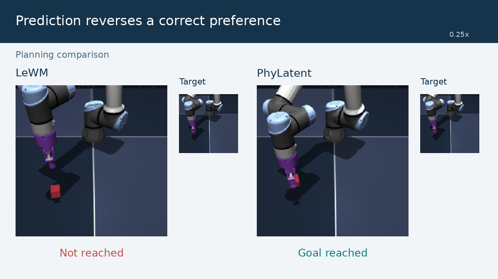

# PhyLatent

[中文说明](README.zh-CN.md)

PhyLatent learns a latent world model with physical state grounding, future
relation alignment, static visual invariance, counterfactual action separation,
and latent denoising. This repository provides the **base method, from-scratch
training and ablations, four inference checkpoints, planning evaluation, and
final collapse diagnostics** for Cube, TwoRooms, Reacher and PushT.

## Method overview


*Figure 3. PhyLatent architecture. [View the vector figure](assets/figures/architecture.svg).*

The observation encoder maps image histories into latent states. An action
encoder and a shared predictor then roll these states forward under candidate
actions. Training adds five complementary objectives in three groups:

- **Physical invariance — SVIP:** keep representations consistent under appearance perturbations.
- **Physical distinguishability — PSG + FRA:** ground representations in physical state and align predicted and observed future relations, including action-conditioned relations.
- **Counterfactual dynamics — CASP + LD:** separate predictions for different actions and learn a conditional latent-denoising objective.

These objectives complement latent prediction and SIGReg regularization.
At inference, the encoder and action-conditioned predictor support CEM-based
model-predictive control: score candidate action sequences against the goal
embedding, execute an action block, and replan from the next observation.
Auxiliary training heads are not needed for planning.

The implementation follows this split: [backbone](src/phylatent/models/jepa.py),
[auxiliary heads](src/phylatent/models/heads.py),
[loss functions](src/phylatent/losses.py),
[training objectives](src/phylatent/training.py), and
[planning](src/phylatent/evaluation/planning.py).

## Watch PhyLatent in action

[](assets/videos/four_tasks_overview.mp4?raw=true)

[Download the four-task overview (MP4)](assets/videos/four_tasks_overview.mp4?raw=true), or download an individual rollout:

- [Cube](assets/videos/cube_full_en.mp4?raw=true)
- [TwoRooms](assets/videos/tworoom_full_en.mp4?raw=true)
- [Reacher](assets/videos/reacher_full_en.mp4?raw=true)
- [PushT](assets/videos/pusht_full_en.mp4?raw=true)

Complete successful rollouts with the target visible throughout.
See [video directory](docs/videos.md).

### Cube collapse diagnostics

[](assets/videos/cube_three_cases_en.mp4?raw=true)

[Download the Cube diagnostics video (MP4)](assets/videos/cube_three_cases_en.mp4?raw=true).
The film shows three forms of collapse and side-by-side LeWM / PhyLatent execution.

## What do the collapse diagnostics detect?


*Empirical diagnostics of the LeWM reference model on Cube, illustrating the
problem addressed by PhyLatent. Red points indicate diagnostic failures; the
planes mark ordering boundaries. This is not a PhyLatent before/after comparison.*

- **Invariance:** an appearance change reverses an otherwise correct near/far ordering.
- **Distinguishability:** a physically farther state appears no farther away in latent space.
- **Counterfactual dynamics:** predicted futures fail to preserve an ordering that is present in the encoded observed futures of different action branches.

The figure uses INV v2, Distinguishability v2 and CF ordering-v3 (horizon 5).
Each panel uniformly samples 2,500 eligible comparisons for display; plotted
point counts are not aggregate failure-rate estimates.
See [visual examples and interpretation](docs/visualizations.md) for actual
observations, plot provenance and limits.

## Installation

Use Linux and Python 3.10+; CUDA is needed for the provided full training and
planning commands. Install a matching PyTorch/torchvision build first, then
run from this repository:

```bash
python -m pip install -e '.[runtime]'
python scripts/verify_checkpoints.py --load
```

Core-only installation for checkpoint inspection and CPU tests:

```bash
python -m pip install -e .
python -m unittest discover -s tests -v
```

The runtime pins stable-pretraining 0.1.7 and stable-worldmodel 0.1.1.
Simulator assets/system libraries must also satisfy their upstream installation
instructions. Full runtime installation and GPU evaluation have not been
validated during extraction; see [validation notes](docs/validation.md).

## Data

Obtain and extract the official datasets as described in [data preparation](docs/data.md).
Place all four HDF5 files in `data/`, or pass another absolute directory.
Datasets are external and are not bundled with this code.

## Train from initialization

```bash
python scripts/train.py --config-name cube data_root=/path/to/data
python scripts/train.py --config-name tworoom data_root=/path/to/data
python scripts/train.py --config-name reacher data_root=/path/to/data
python scripts/train.py --config-name pusht data_root=/path/to/data
```

`tworoom` is the CLI identifier for TwoRooms. Exports are written to
`outputs/<task>/<variant>/seed_<seed>/model/` with `config.json`, `weights.pt`
(latest epoch), and `weights_epoch_<N>.pt`. Use a distinct `output_dir` for
new runs; the entry point never resumes a nonempty output directory.

Cube uses effective batch 128 for ten full epochs. The other base recipes use
batch 32 and at most 10,000 training batches per epoch for ten epochs.
These are base recipes, not a claim to regenerate every bundled paper checkpoint.

## Ablations

Use the same fresh-training entry point and switch the configuration:

```bash
python scripts/train.py --config-name cube ablation=wo_psg data_root=/path/to/data
python scripts/train.py --config-name pusht ablation=wo_counterfactual_group data_root=/path/to/data
```

Available choices: `full`, `wo_psg`, `wo_fra`, `wo_svip`, `wo_casp`, `wo_ld`,
`wo_physical_group`, `wo_invariance_group`, `wo_counterfactual_group`.
Group/component meanings and evaluation denominators are described in
[reproducibility notes](docs/reproducibility.md).

## Pretrained checkpoints and planning

Four checkpoints are included in `checkpoints/<task>/`. Their SHA256 identities
are recorded in `checkpoints/manifest.json`; each has a portable loading config.

```bash
python scripts/evaluate.py cube --seed 600 --model-dir checkpoints/cube \
  --data-root /path/to/data --output outputs/evaluation/cube_seed600.json
```

Default budget: 100 episodes, CEM 300 samples/top-30, ten iterations (30 for
PushT), horizon 5, action block 5, goal offset 25, evaluation budget 50.
Repeat with seeds 600–605 to collect per-seed planning results.

## Collapse diagnostics

```bash
python scripts/diagnose.py --task cube --model-dir checkpoints/cube \
  --data-root /path/to/data --output outputs/diagnostics/cube
```

This reports invariance, distinguishability and **CF ordering-v3**; no legacy
ratio-threshold CF score is used. Add `--smoke` for a small sampling check.
An optional `--reference-dir` runs a paired common-eligibility comparison using
an externally obtained compatible JEPA checkpoint. No baseline source or
baseline weights are bundled. Standalone CF scores have their own denominators.

## Repository layout

```text
assets/figures/       Paper architecture and empirical diagnostic figures
configs/train/       Four base task recipes and loss/component ablations
src/phylatent/       Models, auxiliary losses, preprocessing and training
  evaluation/        Closed-loop CEM planning
  diagnostics/       Frame/branch sampling and final diagnostic statistics
scripts/             Training, evaluation, diagnostics and checkpoint checks
checkpoints/         Four inference weights, loading configs and hash manifest
docs/                Data, reproducibility, source mapping and validation
licenses/            Original third-party license notices
tests/               CPU checks of losses, configurations and metrics
```

## License and citation

The code is released under [MIT](LICENSE). LeWorldModel attribution is retained
in [third-party notices](THIRD_PARTY_NOTICES.md). Data and external dependencies
retain their own licenses. Cite the PhyLatent paper when using this method;
`CITATION.cff` records the software without inventing paper metadata.

The bundled architecture configs have been strictly checked against the weights;
they are loading configs rather than original training histories. For scope and
known reproducibility limits, read [reproducibility notes](docs/reproducibility.md).
