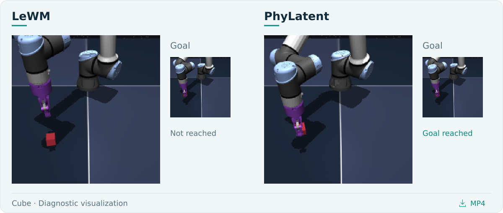
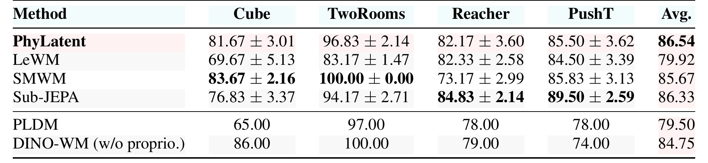
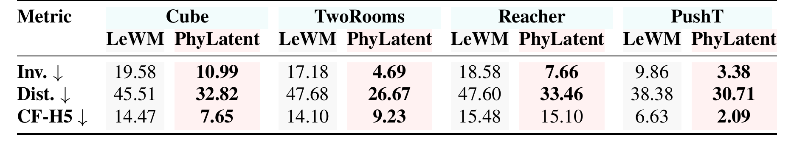
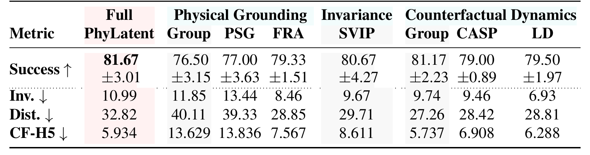
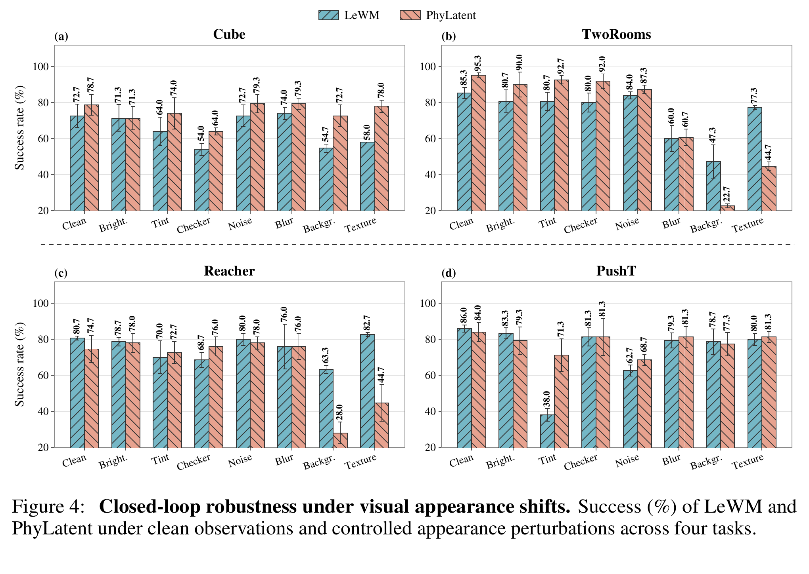
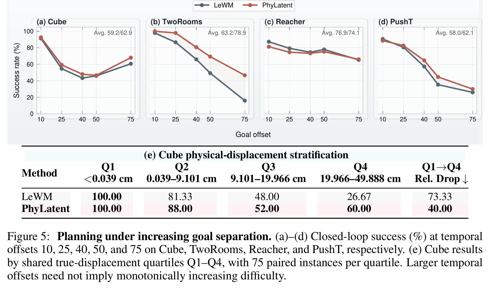
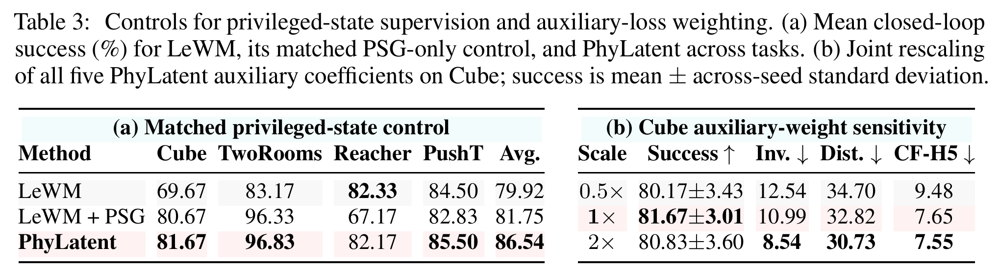
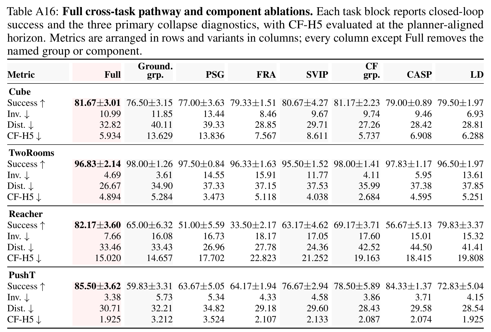

<p align="center">
  <picture>
    <source media="(max-width: 640px)" srcset="assets/readme/hero_motion_en_mobile.gif">
    
  </picture>
</p>

<p align="center">
  <a href="https://arxiv.org/pdf/2608.05720"></a><a href="src/phylatent/"></a><a href="checkpoints/"></a><a href="docs/videos.md"></a>
  <br>
  <sub><a href="README.md">English</a> &nbsp; / &nbsp; <a href="README.zh-CN.md">简体中文</a></sub>
</p>

PhyLatent improves the latent state space of JEPA world models for model predictive control (MPC).
We introduce diagnostics for three forms of collapse and design training objectives that preserve
physical relationships in the learned representation. Our results support the value of reducing
collapse for improving JEPA-based planning.

<p align="center">
  <picture>
    <source media="(max-width: 640px)" srcset="assets/readme/success_en_mobile.svg">
    
  </picture>
  <br>
  <sub>Mean planning success reported in the paper</sub>
</p>

<p align="center"><sub><a href="#method">Method</a> &nbsp; · &nbsp; <a href="#diagnostics">Diagnostics</a> &nbsp; · &nbsp; <a href="#experiments">Experiments</a> &nbsp; · &nbsp; <a href="#demonstrations">Demos</a> &nbsp; · &nbsp; <a href="#installation">Setup</a></sub></p>

<a id="method"></a>

##  Method overview


*Figure 3. PhyLatent architecture. [View the vector figure](assets/figures/architecture.svg).*

MPC compares candidate actions through their predicted future states. A latent space that preserves
physical relationships makes those comparisons more reliable. PhyLatent's objectives are designed
to improve this state space and, in turn, planning success:

- **Physical invariance — SVIP:** keep representations consistent under appearance changes.
- **Physical distinguishability — PSG + FRA:** ground representations in physical state and align predicted and observed future relations.
- **Counterfactual dynamics — CASP + LD:** distinguish the consequences of different actions and support prediction with conditional latent denoising.

The observation encoder maps image histories into latent states. An action-conditioned predictor
rolls them forward for planning. These objectives complement latent prediction and SIGReg regularization;
auxiliary training heads are not needed for planning.

Implementation: [backbone](src/phylatent/models/jepa.py), [auxiliary heads](src/phylatent/models/heads.py),
[losses](src/phylatent/losses.py), [training](src/phylatent/training.py), and [planning](src/phylatent/evaluation/planning.py).

<a id="diagnostics"></a>

##  Diagnosing collapse in the latent state space

We introduce three diagnostics to assess whether the latent state space preserves the physical
relationships needed for planning. The formal definitions and equations are provided in the [paper](https://arxiv.org/pdf/2608.05720).


*Our diagnostics applied to LeWM on Cube. Red points mark collapse; planes mark ordering boundaries.*

- **Invariance:** does changing appearance alter the model's judgment of the same physical states?
- **Distinguishability:** does the model preserve the ordering of physically near and far states?
- **Counterfactual dynamics:** do predictions preserve the ordering found in the observed consequences of different actions?

We evaluate both task success and these properties of the internal state space. Lower collapse rates
indicate better preservation of the corresponding relationships. Together, the planning and diagnostic
results support improving latent structure as a way to strengthen JEPA world models for MPC.

### Visualizing the diagnostics

[](assets/videos/cube_three_cases_en.mp4?raw=true)

[Download the Cube diagnostics video (MP4)](assets/videos/cube_three_cases_en.mp4?raw=true).
The video illustrates the three diagnostic failures and shows LeWM / PhyLatent execution side by side.
More observation examples are in the [visual guide](docs/visualizations.md).

<a id="experiments"></a>

##  Experiments

### Planning across four tasks

With the same backbone and planner, PhyLatent raises average success over LeWM from **79.92% to 86.54%**.
The largest gains are on Cube and TwoRooms; Reacher is effectively tied.

[](https://arxiv.org/pdf/2608.05720#page=6)

<sub>Table 1 · Success (%), mean ± standard deviation across six evaluation seeds. PLDM and DINO-WM are previously reported baselines.</sub>

### Quality of the latent state space

We measure whether physical relationships survive appearance changes, state encoding and future prediction.
Collapse rates decrease across the four tasks; the counterfactual change on Reacher is small.

[](https://arxiv.org/pdf/2608.05720#page=7)

<sub>Table 2 · Lower is better. Inv.: invariance; Dist.: distinguishability; CF-H5: counterfactual dynamics at the planning horizon of five blocks.</sub>

### Pathway and component ablations

Removing Physical Grounding reduces Cube success from **81.67% to 76.50%**.
The objectives act jointly: improving one diagnostic alone does not guarantee better planning.

[](https://arxiv.org/pdf/2608.05720#page=8)

<sub>Table 4 · Each non-Full column removes the named component or group. CF uses a common comparison set across ablations, different from Table 2.</sub>

<details>
<summary><strong>More experiments · robustness, goal separation and full ablations</strong></summary>

### Visual robustness

On Cube, PhyLatent handles background and texture changes better. The response varies by task;
large appearance shifts remain difficult for TwoRooms and Reacher.

[](https://arxiv.org/pdf/2608.05720#page=7)

### Planning over larger goal separations

The paper tests temporal goal offsets and physical displacement. In Cube's largest displacement group,
success rises from **26.67% to 60.00%**.

[](https://arxiv.org/pdf/2608.05720#page=9)

### Supervision and objective weights

[](https://arxiv.org/pdf/2608.05720#page=8)

### Complete four-task ablations

[](https://arxiv.org/pdf/2608.05720#page=26)

</details>

All tables and plots above are taken directly from the [paper](https://arxiv.org/pdf/2608.05720).

<a id="demonstrations"></a>

##  Task demonstrations

[](assets/videos/four_tasks_overview.mp4?raw=true)

[Download the four-task overview (MP4)](assets/videos/four_tasks_overview.mp4?raw=true), or download an individual rollout:

<p align="center">
  <a href="assets/videos/cube_full_en.mp4?raw=true">Cube</a> &nbsp; · &nbsp; <a href="assets/videos/tworoom_full_en.mp4?raw=true">TwoRooms</a> &nbsp; · &nbsp; <a href="assets/videos/reacher_full_en.mp4?raw=true">Reacher</a> &nbsp; · &nbsp; <a href="assets/videos/pusht_full_en.mp4?raw=true">PushT</a>
</p>

Complete successful rollouts with the target visible throughout. See the [video directory](docs/videos.md).

<a id="installation"></a>

##  Getting started

### Installation

Use Linux and Python 3.10+; CUDA is needed for the provided full training and
planning commands. Install a matching PyTorch/torchvision build first, then
run from this repository:

```bash
python -m pip install -e '.[runtime]'
python scripts/verify_checkpoints.py --load
```

Core-only installation for checkpoint inspection and CPU tests:

```bash
python -m pip install -e .
python -m unittest discover -s tests -v
```

The runtime pins stable-pretraining 0.1.7 and stable-worldmodel 0.1.1.
Simulator assets/system libraries must also satisfy their upstream installation
instructions. For verification commands and supported checks, see [verification](docs/validation.md).

### Data

Obtain and extract the official datasets as described in [data preparation](docs/data.md).
Place all four HDF5 files in `data/`, or pass another absolute directory.
Datasets are external and are not bundled with this code.

### Train from initialization

```bash
python scripts/train.py --config-name cube data_root=/path/to/data
python scripts/train.py --config-name tworoom data_root=/path/to/data
python scripts/train.py --config-name reacher data_root=/path/to/data
python scripts/train.py --config-name pusht data_root=/path/to/data
```

`tworoom` is the CLI identifier for TwoRooms. Exports are written to
`outputs/<task>/<variant>/seed_<seed>/model/` with `config.json`, `weights.pt`
(latest epoch), and `weights_epoch_<N>.pt`. Use a distinct `output_dir` for
new runs; the entry point never resumes a nonempty output directory.

Cube uses effective batch 128 for ten full epochs. The other base recipes use
batch 32 and at most 10,000 training batches per epoch for ten epochs.
For training details and checkpoint reproducibility, see [training and evaluation notes](docs/reproducibility.md).

### Ablations

Use the same fresh-training entry point and switch the configuration:

```bash
python scripts/train.py --config-name cube ablation=wo_psg data_root=/path/to/data
python scripts/train.py --config-name pusht ablation=wo_counterfactual_group data_root=/path/to/data
```

Available choices: `full`, `wo_psg`, `wo_fra`, `wo_svip`, `wo_casp`, `wo_ld`,
`wo_physical_group`, `wo_invariance_group`, `wo_counterfactual_group`.
See [training and evaluation notes](docs/reproducibility.md) for the loss groups and diagnostic metrics.

### Pretrained checkpoints and planning

Four checkpoints are included in `checkpoints/<task>/`. Their SHA256 identities
are recorded in `checkpoints/manifest.json`; each has a portable loading config.

```bash
python scripts/evaluate.py cube --seed 600 --model-dir checkpoints/cube \
  --data-root /path/to/data --output outputs/evaluation/cube_seed600.json
```

Default budget: 100 episodes, CEM 300 samples/top-30, ten iterations (30 for
PushT), horizon 5, action block 5, goal offset 25, evaluation budget 50.
Repeat with seeds 600–605 to collect per-seed planning results.

### Collapse diagnostics

```bash
python scripts/diagnose.py --task cube --model-dir checkpoints/cube \
  --data-root /path/to/data --output outputs/diagnostics/cube
```

This reports invariance, distinguishability and counterfactual dynamics diagnostics.
Use `--smoke` for a small trial run. To compare with a reference model, pass its
compatible JEPA checkpoint directory using `--reference-dir`.
See [metric definitions](docs/reproducibility.md#diagnostic-metrics) for how the comparisons are measured.

### Repository layout

```text
assets/              Paper figures, homepage graphics and video demonstrations
configs/train/       Four base task recipes and loss/component ablations
src/phylatent/       Models, auxiliary losses, preprocessing and training
  evaluation/        Closed-loop CEM planning
  diagnostics/       Observation/action sampling and diagnostic metrics
scripts/             Training, evaluation, diagnostics and checkpoint checks
checkpoints/         Four inference weights, loading configs and hash manifest
docs/                Data, training, evaluation and visual guides
licenses/            Original third-party license notices
tests/               CPU checks of losses, configurations and metrics
```

## License and citation

The code is released under [MIT](LICENSE). LeWorldModel attribution is retained
in [third-party notices](THIRD_PARTY_NOTICES.md). Data and external dependencies
retain their own licenses. Please cite the PhyLatent paper when using this method;
citation metadata is provided in [CITATION.cff](CITATION.cff).

[Paper (PDF)](https://arxiv.org/pdf/2608.05720) · [arXiv abstract](https://arxiv.org/abs/2608.05720)

```bibtex
@misc{zeng2026phylatent,
  title         = {PhyLatent: Learning Dynamics-Relevant Representations for JEPA World Models},
  author        = {Xi Zeng and Haojie Ren and Ziying Song and Yuanbo Nie and Ross Drummond},
  year          = {2026},
  eprint        = {2608.05720},
  archivePrefix = {arXiv},
  primaryClass  = {cs.CV},
  doi           = {10.48550/arXiv.2608.05720},
  url           = {https://arxiv.org/abs/2608.05720}
}
```
