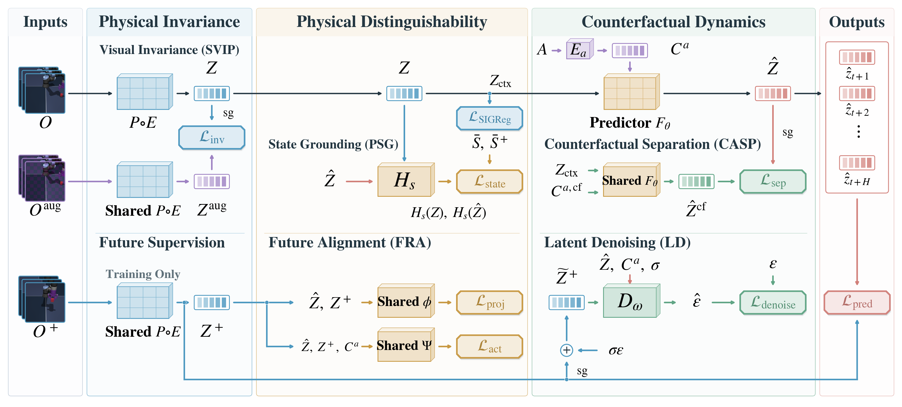
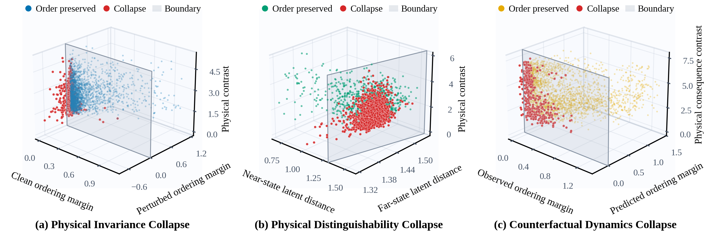
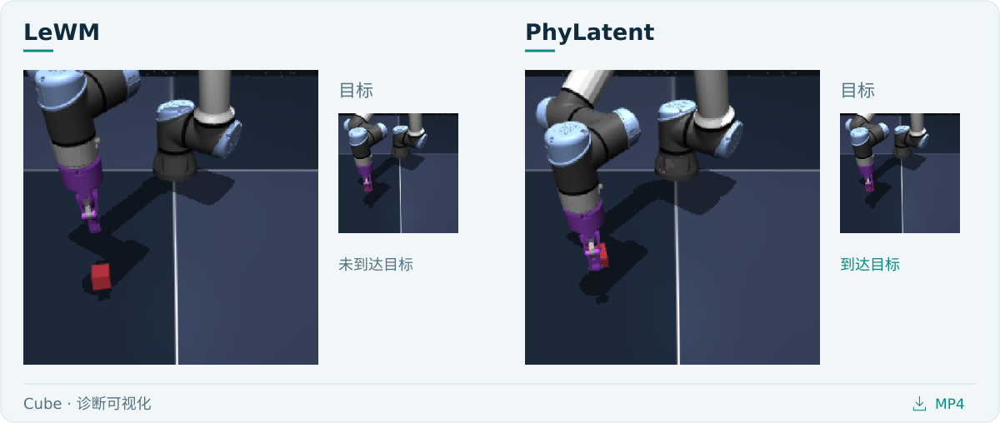
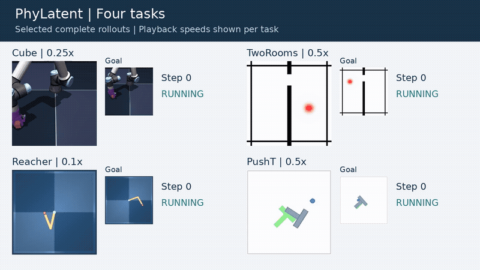

<p align="center">
  <picture>
    <source media="(max-width: 640px)" srcset="assets/readme/hero_zh_mobile.svg">
    
  </picture>
</p>

<p align="center">
  <a href="https://arxiv.org/pdf/2608.05720"></a>&nbsp;<a href="src/phylatent/"></a>
  <br>
  <a href="checkpoints/"></a>&nbsp;<a href="docs/videos.md"></a>
</p>

<p align="center">
  <a href="README.md">English</a> &nbsp; / &nbsp; <a href="README.zh-CN.md">简体中文</a>
</p>

PhyLatent 通过改善 JEPA 世界模型的潜在状态空间，提升模型预测控制（MPC）的规划能力。
我们提出三类坍缩的诊断方法，并设计训练目标，让模型内部的表示更好地保持物理关系。
实验结果支持：减少内部结构的坍缩，有助于提升 JEPA 的规划能力。

<p align="center">
  <picture>
    <source media="(max-width: 640px)" srcset="assets/readme/success_zh_mobile.svg">
    
  </picture>
  <br>
  <sub>论文报告的平均任务成功率</sub>
</p>

## 方法结构



*Figure 3：PhyLatent 整体结构。[查看矢量图](assets/figures/architecture.svg)。*

MPC 通过预测的未来状态比较候选动作。状态空间越能保持正确的物理关系，这种比较就越可靠。
PhyLatent 的各项设计都围绕改善状态空间展开，进而提高规划成功率：

- **物理不变性 — SVIP：** 外观变化时，表示保持一致。
- **物理可区分性 — PSG + FRA：** 用物理状态约束表示，对齐预测未来与真实未来的关系。
- **反事实动力学 — CASP + LD：** 区分不同动作的后果，并通过条件潜在去噪辅助预测学习。

观测编码器将历史图像编码为潜在状态，动作条件预测器据此推演未来，用于规划。
这些目标与潜在预测损失、SIGReg 正则共同训练；规划时不需要辅助训练头。

代码对应：[模型主干](src/phylatent/models/jepa.py)、[辅助头](src/phylatent/models/heads.py)、
[损失函数](src/phylatent/losses.py)、[训练](src/phylatent/training.py)和[规划](src/phylatent/evaluation/planning.py)。

## 潜在状态空间的坍缩诊断

我们提出三类诊断，检查潜在状态空间是否保持了规划所需的物理关系。具体定义与公式见[论文](https://arxiv.org/pdf/2608.05720)。



*将诊断方法应用于 Cube 上的 LeWM。红点表示坍缩，平面表示排序判别边界。*

- **不变性：** 外观改变后，模型对同一组物理状态的判断是否保持一致？
- **可区分性：** 模型能否正确区分物理上近、远的状态？
- **反事实动力学：** 不同动作的真实后果具有一定排序，预测能否保持这种关系？

我们同时关注任务成功率与内部状态空间的质量。坍缩率越低，说明相应的物理关系保持得越好。
规划与诊断结果共同支持：改善潜在空间的内部结构，有助于增强 JEPA 世界模型的 MPC 规划能力。

### 诊断可视化

[](assets/videos/cube_three_cases_zh.mp4?raw=true)

[下载 Cube 坍缩诊断视频 MP4](assets/videos/cube_three_cases_zh.mp4?raw=true)。
视频展示三类诊断错误，并呈现 LeWM 与 PhyLatent 的并排执行过程。
更多真实观测示例见[可视化说明](docs/visualizations.zh-CN.md)。

## 四任务完整演示

[](assets/videos/four_tasks_overview.mp4?raw=true)

[下载四任务合集 MP4](assets/videos/four_tasks_overview.mp4?raw=true)，或下载各任务的完整视频：

<p align="center">
  <a href="assets/videos/cube_full_zh.mp4?raw=true">Cube</a> &nbsp; · &nbsp; <a href="assets/videos/tworoom_full_zh.mp4?raw=true">TwoRooms</a> &nbsp; · &nbsp; <a href="assets/videos/reacher_full_zh.mp4?raw=true">Reacher</a> &nbsp; · &nbsp; <a href="assets/videos/pusht_full_zh.mp4?raw=true">PushT</a>
</p>

完整展示各任务的成功执行过程，画面全程保留目标。更多视频见[视频目录](docs/videos.md)。

## 安装

使用 Linux 和 Python 3.10 及以上版本；所附完整训练和规划命令需要 CUDA。
先安装与机器匹配的 PyTorch/torchvision，再在本目录执行：

```bash
python -m pip install -e '.[runtime]'
python scripts/verify_checkpoints.py --load
```

只检查模型和运行 CPU 核心测试时：

```bash
python -m pip install -e .
python -m unittest discover -s tests -v
```

运行依赖固定 stable-pretraining 0.1.7 和 stable-worldmodel 0.1.1；模拟器所需
系统库和资产按其上游说明安装。检查命令与验证范围见[验证说明](docs/validation.md)。

## 数据准备

按[数据说明](docs/data.md)获取官方数据并解压。四个 HDF5 放在 `data/` 下，
也可以通过参数指定其他绝对路径。原始数据不随代码打包。

## 从头训练

```bash
python scripts/train.py --config-name cube data_root=/path/to/data
python scripts/train.py --config-name tworoom data_root=/path/to/data
python scripts/train.py --config-name reacher data_root=/path/to/data
python scripts/train.py --config-name pusht data_root=/path/to/data
```

TwoRooms 在命令中写作 `tworoom`。输出位于
`outputs/<task>/<variant>/seed_<seed>/model/`，包括加载配置 `config.json`、
最新 epoch 的 `weights.pt` 和逐 epoch 的 `weights_epoch_<N>.pt`。
不同运行使用不同 `output_dir`；入口不会自动恢复非空目录中的旧训练。

Cube 使用 microbatch 32 × 梯度累积 4，有效 batch 128，训练十个完整 epochs。
其他任务基础配方 batch 32、十个 epochs，每 epoch 最多 10,000 个训练 batches。
训练细节与权重复现范围见[训练与评估说明](docs/reproducibility.md)。

## 消融

复用同一从头训练入口，通过配置关闭相应损失：

```bash
python scripts/train.py --config-name cube ablation=wo_psg data_root=/path/to/data
python scripts/train.py --config-name pusht ablation=wo_counterfactual_group data_root=/path/to/data
```

可选：`full`、`wo_psg`、`wo_fra`、`wo_svip`、`wo_casp`、`wo_ld`、
`wo_physical_group`、`wo_invariance_group`、`wo_counterfactual_group`。
各损失分组和诊断指标的含义见[训练与评估说明](docs/reproducibility.md)。

## 现成权重与规划评估

四任务权重在 `checkpoints/<task>/`，均有可加载的结构配置；
`checkpoints/manifest.json` 记录文件 SHA256。

```bash
python scripts/evaluate.py cube --seed 600 --model-dir checkpoints/cube \
  --data-root /path/to/data --output outputs/evaluation/cube_seed600.json
```

默认评估 100 个 episodes；CEM 300 samples/top-30，迭代十次（PushT 三十次）；
规划 horizon 5、action block 5、goal offset 25、evaluation budget 50。
使用 seeds 600–605 分别运行，保存逐 seed 结果。

## 三类坍缩诊断

```bash
python scripts/diagnose.py --task cube --model-dir checkpoints/cube \
  --data-root /path/to/data --output outputs/diagnostics/cube
```

输出不变性、可区分性和反事实动力学诊断。加 `--smoke` 可先运行少量数据。
需要与参考模型比较时，用 `--reference-dir` 指定兼容 JEPA 权重的目录。
指标计算方式见[诊断指标说明](docs/reproducibility.md#diagnostic-metrics)。

## 目录结构

```text
assets/              论文插图、首页视觉素材与演示视频
configs/train/       四任务基础配方与组件/分组消融
src/phylatent/       模型、辅助损失、预处理和训练
  evaluation/        闭环 CEM 规划评估
  diagnostics/       观测与动作分支采样、诊断指标
scripts/             训练、评估、诊断和权重校验入口
checkpoints/         四任务推理权重、配置和哈希清单
docs/                数据、训练、评估与可视化说明
licenses/            沿用代码的原始许可证
tests/               损失、配置和指标的 CPU 检查
```

## 许可与引用

代码采用 [MIT](LICENSE)，保留 [LeWorldModel 等必要来源声明](THIRD_PARTY_NOTICES.md)。
数据与外部依赖各自遵循其许可证。使用本方法请引用 PhyLatent 论文；
引用信息见 [CITATION.cff](CITATION.cff)。

[论文 PDF](https://arxiv.org/pdf/2608.05720) · [arXiv 摘要页](https://arxiv.org/abs/2608.05720)

```bibtex
@misc{zeng2026phylatent,
  title         = {PhyLatent: Learning Dynamics-Relevant Representations for JEPA World Models},
  author        = {Xi Zeng and Haojie Ren and Ziying Song and Yuanbo Nie and Ross Drummond},
  year          = {2026},
  eprint        = {2608.05720},
  archivePrefix = {arXiv},
  primaryClass  = {cs.CV},
  doi           = {10.48550/arXiv.2608.05720},
  url           = {https://arxiv.org/abs/2608.05720}
}
```
