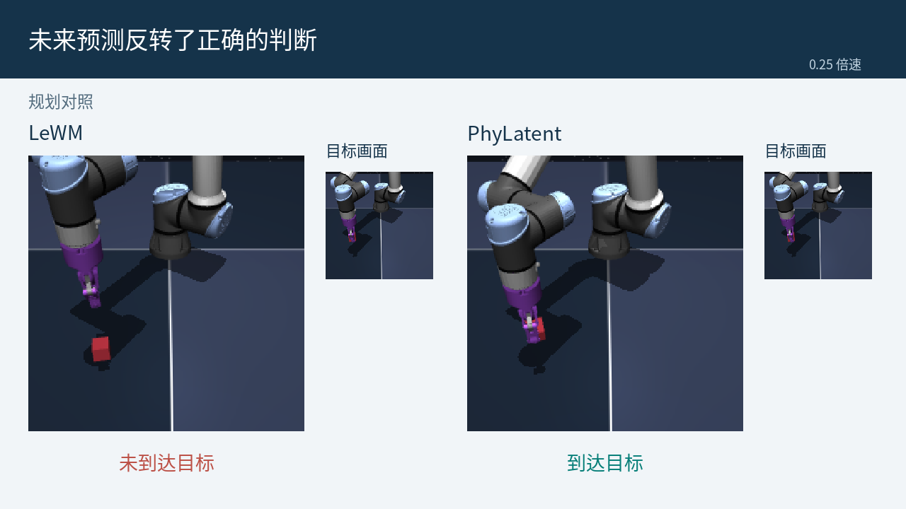

# PhyLatent

[English](README.md)

PhyLatent 通过物理状态监督、未来关系对齐、静态视觉不变性、反事实动作分离和
latent 去噪学习潜在世界模型。本目录提供 **基础方法、从头训练、消融、四任务推理
权重、规划评估和最终坍缩诊断**，覆盖 Cube、TwoRooms、Reacher、PushT。

## 方法结构


*Figure 3：PhyLatent 整体结构。[查看矢量图](assets/figures/architecture.svg)。*

观测编码器先把历史图像编码成潜在状态；动作编码器与共享预测器再根据候选动作，
预测未来的潜在状态。训练时，五个辅助目标组成三组约束：

- **物理不变性 — SVIP：** 外观扰动前后的表示保持一致。
- **物理可区分性 — PSG + FRA：** 用物理状态监督约束表示，并对齐预测未来与观测未来的关系，包括动作条件下的关系。
- **反事实动力学 — CASP + LD：** 使不同动作的未来预测有所区分，并通过条件 latent 去噪提供辅助学习目标。

这五个目标与潜在预测损失、SIGReg 正则共同训练。推理时，编码器与动作条件预测器
用于 CEM 模型预测控制：比较候选动作序列的预测与目标表示，执行一段动作，
再根据新观测重新规划。规划不需要训练时使用的辅助头。

代码对应为：[模型主干](src/phylatent/models/jepa.py)、
[辅助头](src/phylatent/models/heads.py)、[损失函数](src/phylatent/losses.py)、
[训练目标组合](src/phylatent/training.py)和[规划评估](src/phylatent/evaluation/planning.py)。

## 四任务完整演示

[](assets/videos/four_tasks_overview.mp4?raw=true)

[下载四任务合集 MP4](assets/videos/four_tasks_overview.mp4?raw=true)，或下载各任务的完整视频：

- [Cube](assets/videos/cube_full_zh.mp4?raw=true)
- [TwoRooms](assets/videos/tworoom_full_zh.mp4?raw=true)
- [Reacher](assets/videos/reacher_full_zh.mp4?raw=true)
- [PushT](assets/videos/pusht_full_zh.mp4?raw=true)

完整展示各任务的成功执行过程，画面全程保留目标。
更多视频见[视频目录](docs/videos.md)。

### Cube 坍缩诊断

[](assets/videos/cube_three_cases_zh.mp4?raw=true)

[下载 Cube 坍缩诊断视频 MP4](assets/videos/cube_three_cases_zh.mp4?raw=true)。
展示三类坍缩现象，以及 LeWM 与 PhyLatent 的并排执行过程。

## 三类坍缩分别在辨识什么？


*图中为 Cube 上 LeWM 参考模型的实测诊断，用来说明 PhyLatent 要解决的问题。
红点表示诊断失败，平面表示排序判别边界；这张图不是 PhyLatent 改进前后的对比。*

- **不变性坍缩：** 只改变外观，原本正确的远近排序却反转了。
- **可区分性坍缩：** 物理上更远的状态，在潜在空间里却不比近状态更远。
- **反事实动力学坍缩：** 不同动作分支的实际未来经编码后存在明确排序，预测未来却未能保持这一排序。

图采用 INV v2、Distinguishability v2 和 CF ordering-v3（horizon 5）。
每个面板均匀抽取 2,500 个合格比较用于展示；不能用画面中的点数估算总体失败率。
真实观测案例、图片来源和解读边界见[可视化说明](docs/visualizations.zh-CN.md)。

## 安装

使用 Linux 和 Python 3.10 及以上版本；所附完整训练和规划命令需要 CUDA。
先安装与机器匹配的 PyTorch/torchvision，再在本目录执行：

```bash
python -m pip install -e '.[runtime]'
python scripts/verify_checkpoints.py --load
```

只检查模型和运行 CPU 核心测试时：

```bash
python -m pip install -e .
python -m unittest discover -s tests -v
```

运行依赖固定 stable-pretraining 0.1.7 和 stable-worldmodel 0.1.1；模拟器所需
系统库和资产按其上游说明安装。本次整理未验证完整运行环境安装或 GPU 评估，
已完成的检查见[验证记录](docs/validation.md)。

## 数据准备

按[数据说明](docs/data.md)获取官方数据并解压。四个 HDF5 放在 `data/` 下，
也可以通过参数指定其他绝对路径。原始数据不随代码打包。

## 从头训练

```bash
python scripts/train.py --config-name cube data_root=/path/to/data
python scripts/train.py --config-name tworoom data_root=/path/to/data
python scripts/train.py --config-name reacher data_root=/path/to/data
python scripts/train.py --config-name pusht data_root=/path/to/data
```

TwoRooms 在命令中写作 `tworoom`。输出位于
`outputs/<task>/<variant>/seed_<seed>/model/`，包括加载配置 `config.json`、
最新 epoch 的 `weights.pt` 和逐 epoch 的 `weights_epoch_<N>.pt`。
不同运行使用不同 `output_dir`；入口不会自动恢复非空目录中的旧训练。

Cube 使用 microbatch 32 × 梯度累积 4，有效 batch 128，训练十个完整 epochs。
其他任务基础配方 batch 32、十个 epochs，每 epoch 最多 10,000 个训练 batches。
这提供的是基础训练配方，不承诺直接生成所有随附论文权重。

## 消融

复用同一从头训练入口，通过配置关闭相应损失：

```bash
python scripts/train.py --config-name cube ablation=wo_psg data_root=/path/to/data
python scripts/train.py --config-name pusht ablation=wo_counterfactual_group data_root=/path/to/data
```

可选：`full`、`wo_psg`、`wo_fra`、`wo_svip`、`wo_casp`、`wo_ld`、
`wo_physical_group`、`wo_invariance_group`、`wo_counterfactual_group`。
分组含义和诊断分母见[复现说明](docs/reproducibility.md)。

## 现成权重与规划评估

四任务权重在 `checkpoints/<task>/`，均有可加载的结构配置；
`checkpoints/manifest.json` 记录文件 SHA256。

```bash
python scripts/evaluate.py cube --seed 600 --model-dir checkpoints/cube \
  --data-root /path/to/data --output outputs/evaluation/cube_seed600.json
```

默认评估 100 个 episodes；CEM 300 samples/top-30，迭代十次（PushT 三十次）；
规划 horizon 5、action block 5、goal offset 25、evaluation budget 50。
使用 seeds 600–605 分别运行，保存逐 seed 结果。

## 三类坍缩诊断

```bash
python scripts/diagnose.py --task cube --model-dir checkpoints/cube \
  --data-root /path/to/data --output outputs/diagnostics/cube
```

输出物理不变性、物理可区分性和 **CF ordering-v3**，不使用旧 ratio-threshold
指标。加 `--smoke` 可做小规模采样检查。需要配对比较时，可通过
`--reference-dir` 指定另行获取的兼容 JEPA 权重，以共同 eligibility 计算；
本包不包含其他方法源码或权重。单模型 CF 分母与配对分母不同。

## 目录结构

```text
assets/figures/       论文结构图与实测诊断图
configs/train/       四任务基础配方与组件/分组消融
src/phylatent/       模型、辅助损失、预处理和训练
  evaluation/        闭环 CEM 规划评估
  diagnostics/       帧/动作分支采样与最终诊断统计
scripts/             训练、评估、诊断和权重校验入口
checkpoints/         四任务推理权重、配置和哈希清单
docs/                数据、复现、来源和验证说明
licenses/            沿用代码的原始许可证
tests/               损失、配置和指标的 CPU 检查
```

## 许可与引用

代码采用 [MIT](LICENSE)，保留 [LeWorldModel 等必要来源声明](THIRD_PARTY_NOTICES.md)。
数据与外部依赖各自遵循其许可证。使用本方法请引用 PhyLatent 论文；
`CITATION.cff` 仅记录软件信息，没有虚构论文题目、作者或 DOI。

权重配置已通过严格加载核验，但属于加载配置而非原始训练履历。
公开代码与现成模型的对应范围，以及已知复现限制，见[复现说明](docs/reproducibility.md)。
