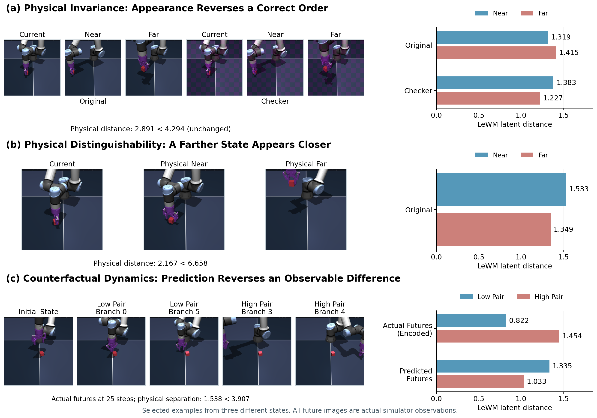

# 可视化说明

[English](visualizations.md) · [返回首页](../README.zh-CN.md)

## 结构图

Figure 3 展示 PhyLatent 如何学习和使用潜在世界模型。
编码器表示当前观测，预测器根据候选动作估计未来状态。
辅助目标用于训练，规划使用编码器和预测器。
重复出现的编码器、预测器共享参数，`sg` 表示停止梯度。

## 坍缩诊断图

我们提出三类诊断，检查潜在空间是否保持规划所需的物理关系，具体定义与公式见论文。
散点图展示这些诊断在 **Cube 上 LeWM 参考模型**的应用。
红点表示排序错误，其他颜色表示排序保持正确，平面表示两者的判别边界。

- **不变性：** 外观改变后，模型对远近的判断反转。
- **可区分性：** 物理上更远的状态，在潜在空间中反而更近。
- **反事实动力学：** 真实未来经编码后的排序，在预测未来时被反转。

这张图用于说明坍缩现象，不是 PhyLatent 与 LeWM 的性能对比或任务成功率统计。

## 真实观测

从上到下分别展示：

1. 棋盘纹理改变外观，物理状态保持不变。
2. 物理上近、远的状态，被模型排错顺序。
3. 不同动作产生的真实未来，其排序未被预测器保持。

未来画面来自模拟器的真实观测。模型预测的是潜在状态，不是渲染图像。
